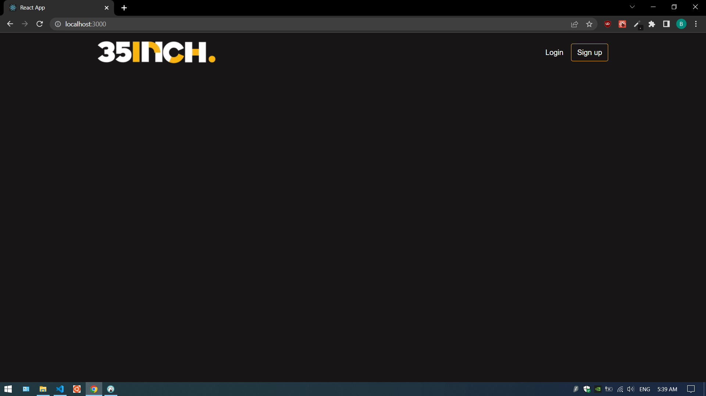

# 35Inch News Webapp

A Haber Module web project 


## Deployment

To deploy this project run
```bash
  $ git clone https://github.com/bahlbii/35inch-news.git
```
server side:
```bash
  $ git clone https://github.com/bahlbii/35inch-news.git
  $ cd backend
  $ npm install
  $ nodemon server
```
client side:
```bash
  $ cd client
  $ npm install
  $ npm start
```

To serve build of project
server side:
```bash
  $ git clone https://github.com/bahlbii/35inch-news.git
  $ cd backend
  $ npm install
  $ nodemon server
```
client side:
```bash
  $ cd client
  $ npm serve build
  $ serve -s build
```
```
### Techstack - PERN
```
1. Hosted postgreSQL on elephantsql.com was used
2. React + bootstrap and MDBootstrap(material design with bootstarp) was used for frontend.
3. Nodejs for the backend and Axios for hitting API endpoints.
4. Postman was used to test all API calls
```

## Demo 




